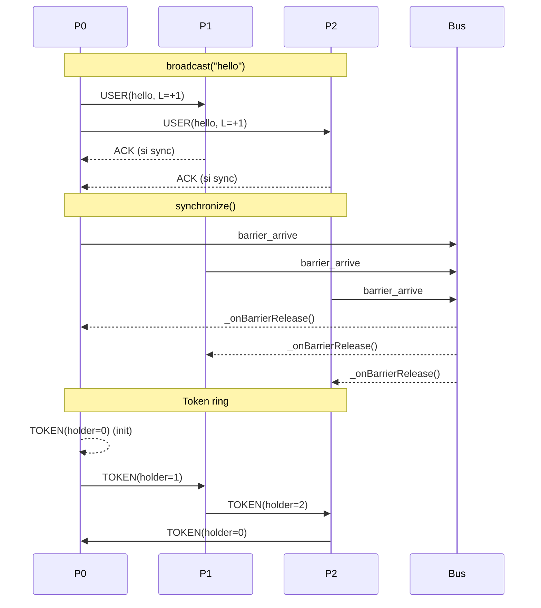

# INFO901
Authors: Entela MEMA


# TP Middleware — README

Un mini-middleware distribué en Python qui fournit :

* horloge de **Lamport**
* **boîte aux lettres** (BAL)
* primitives **async** (`broadcast`, `sendTo`)
* primitives **sync** avec **ACK** (`broadcastSync`, `sendToSync`, `recvFromSync`)
* **barrière** globale (`synchronize`)
* **section critique** par **jeton (token)** sur anneau
* intégration **PyBus** façon `@subscribe`

---

## 1) Prérequis

* Python 3.10+

  ```bash
  pip install pyeventbus3
  ```

---

## 2) Lancer la démo

Depuis la racine du projet :

```bash
python3 Launcher.py
```

Vous devriez voir des lignes du type :

```
[MAIN] starting demo
[P0] start, world_size=3
[P1] start, world_size=3
[P2] start, world_size=3
[P0] @subscribe UserEvent from 0 L=1 payload={'BONJOUR': 'from 0'}
...
[P1] waiting barrier
[P1] passed barrier
...
[P1] request SC
[P1] IN  SC
[P1] release SC
...
[MAIN] done
```

> **WORLD\_SIZE** est fixé dans `Com.py` (constante). Par défaut `WORLD_SIZE = 3`.
> Si vous changez le nombre de processus lancés dans `Launcher.py`, ajustez aussi `WORLD_SIZE`.

---

## 3) Structure du repo

```
BroadcastMessage.py   # message applicatif diffusé à tous
Bus.py                # bus mémoire partagé (réseau simulé)
Com.py                # communicateur/middleware (API + Lamport + SC + barrière)
Events.py             # UserEvent / TokenEvent pour PyBus (@subscribe)
Launcher.py           # script de démo (lance N Process en threads)
Message.py            # base Message + MsgKind + AckMessage
MessageTo.py          # message applicatif point-à-point
Process.py            # "application" qui utilise Com (+ handlers @subscribe)
Synchronize.py        # message de barrière (la logique est dans Bus)
Token.py              # message système 'Token' pour la SC
```

---

## 4) Comment ça marche (éléments clés)

### Bus (Bus.py)

* Joue le rôle de **réseau** in-process.
* Maintient un **annuaire** des `Com` vivants et leur ordre logique.
* **Diffusion** (`broadcast`) et **envoi direct** (`sendto`) appellent la méthode interne `_deliver()` du destinataire.
* Gère la **barrière** : chaque `Com.synchronize()` appelle `bus.barrier_arrive(uid)`. Quand **tous** sont arrivés, le Bus déclenche `_onBarrierRelease()` chez chacun (ça débloque `synchronize()`).

### Com (Com.py)

Le **communicateur** interpose toutes les comms :

* **Horloge de Lamport** :

  * `inc_clock()` à l’envoi ;
  * `update_clock_on_recv()` à la réception d’un **message utilisateur**.
* **BAL** : chaque message applicatif reçu est déposé en file (`receive()` le lit).
* **Async** :

  * `broadcast(payload)` → à tous (sauf soi) ;
  * `sendTo(payload, dest)` → à un id logique.
* **Sync** (ACK) :

  * `broadcastSync(payload, from_id)` → attend **N-1 ACK** ;
  * `sendToSync(payload, dest)` → attend **1 ACK** ;
  * `recvFromSync(from_id)` → lit bloquant jusqu’à ce que le prochain message **provenant de `from_id`** arrive.
* **Barrière** :

  * `synchronize()` bloque jusqu’au signal du Bus (`_onBarrierRelease()`).
* **Section critique par jeton** (style prof) :

  * `requestSC()` met `sc_state="request"` et **attend** d’entrer en SC ;
  * **réception du `Token`** (dans `_deliver`) :

    * si `sc_state=="request"` → passe `sc_state="sc"`, réveille `requestSC()`, **attend** que `releaseSC()` mette `"release"`, puis **envoie le token au suivant** ;
    * sinon → **forward immédiat** au suivant ;
    * l’envoi du token est **asynchrone** pour éviter une chaîne de livraisons récursive ;
  * `releaseSC()` **ne renvoie pas** le token : il met juste `sc_state="release"`.
* **PyBus (optionnel)** : à **chaque envoi**, `Com` publie un `UserEvent(sender, lamport, payload)`. Vos `Process` peuvent définir des handlers `@subscribe(onEvent=UserEvent)` pour logger.

### Process (Process.py)

* Crée un `Com` puis exécute un **scénario de démonstration** :

  * envois **async** puis **sync** (+ ACK) ;
  * `synchronize()` ;
  * `requestSC()` → travail critique → `releaseSC()`.
* Si PyBus est installé, `Process` **s’abonne** (`register`) et possède un handler :

  ```python
  @subscribe(threadMode=Mode.PARALLEL, onEvent=UserEvent)
  def on_user_msg(self, e: UserEvent): ...
  ```

---

## 5) Points d’attention / Paramétrage

* **WORLD\_SIZE** (anneau fixe) : modifiez la constante dans `Com.py` si vous changez le nombre de `Process` dans `Launcher.py`.
* **Pas d’attente active côté API** (sauf la boucle `while` dans onToken demandée par le prof). Les blocages se font via `threading.Event`.
* **Messages système** (`TOKEN`, `ACK`, `RENUMBER`, `BARRIER`) **n’influencent pas** l’horloge de Lamport.
* **PyBus** : si vous relancez dans le même interpréteur, pensez à `unregister` dans `Process.close()` (déjà fait).

---

## 6) Petit diagramme (séquence simplifiée)



---

## 7) Modifier le nombre de processus

* Dans `Launcher.py`, changez le `range` :

  ```python
  procs = [Process(bus, name=f"P{i}") for i in range(4)]
  ```
* Dans `Com.py`, changez la constante :

  ```python
  WORLD_SIZE = 4
  ```

